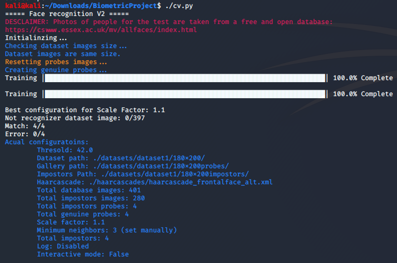
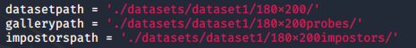
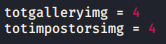

# Face Recognition Evaluation
Performance evaluation of a biometric facial recognition system.
The datasets image are fewer from the original evaluation, feel free to populate your datasets with your images but befor that read the report.

# OpenCV Intallation
## Dependencies
```bash
#[compiler]
sudo apt-get install build-essential
#[required]
sudo apt-get install cmake git libgtk2.0-dev pkg-config libavcodec-dev libavformat-dev libswscale-dev
#[optional]
sudo apt-get install python-dev python-numpy libtbb2 libtbb-dev libjpeg-dev libpng-dev libtiff-dev libdc1394-22-dev
```
The official guide tell to install `libjasper-dev` library but it gave me error, `apt` couldn't loce the file so i didn't installed and worked fine anyway.
## PIP3
Install `pip3` to install python libraries because it's written in python3.
``` bash
sudo apt-get install python3-pip
```
## Install OpenCV
``` bash
sudo pip3 install opencv-python
```
Install also contrib libraries, you might need it better have it just in case.
``` bash
sudo pip3 install opencv-contrib-python 
```
## Conclusion
Now you are ready to go:
- Download and extract the project.
- Populate the datasets that are inside `datasets` folder, remember to enable your change dataset paths, the default one is set to `./datasets/dataset1/...`.<br/>

- Change the number of genuine probes and impostor probes in the code.<br/>
<br/>
Yes i know `totgalleryimg` is not the right name for genuine probes variable but hey! now you know it that the variable stand for the quantity of genuine probes so change it as u wish.
- Execute `python3 cv.py` and enjoy the evaluation.
